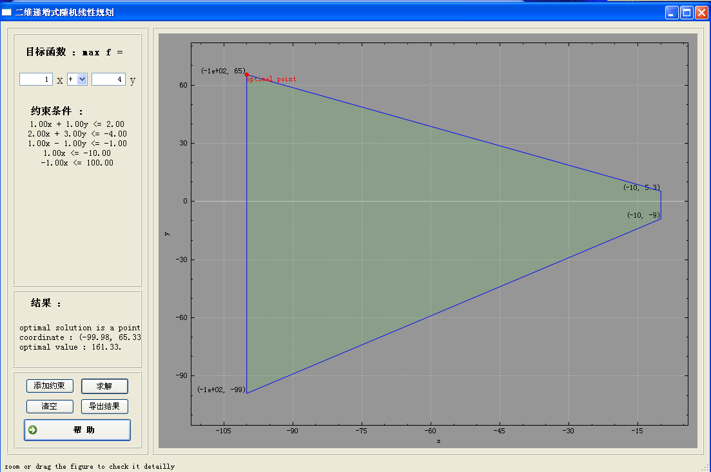

TDIRLP
======

Two Dimensional Incremental Random Linear Programming (TDIRLP) for my Computational Geometry homework.

In this project, I implement a simple but useful software to solve Two Dimensional Linear Programming (TDLP) problem.
In order to create UI easily with C++, I develope this project based on Qt library.

I do all of this from scratch and some new functions will be added in the follow-up work.

Requirements
============
* Qt library (http://qt-project.org/)

Usage
============
1. Click add constraints button to add new constraint for the linear programming.
2. After adding all the constraints, please input the objective funtion in the left top panel.
3. Click solve button to get the answer of the linear programming.
4. The result will be displayed in the result panel.
5. Click export result button to save the problem and its answer to a specified file with pdf format.
6. Click the clear button to clean all the items in the UI and then you can input a new problem.

Screenshot
===========

*(note: the green region is feasible)*

Platform 
===========
This code is only tested on Linux mint-16 64-bit. But I will transplant the code to windows for my homework submission.

<!--
Contact 
===========
If you have any question about this code, please contact me directly.
E-mail : chengshaoguang@mail.nwpu.edu.cn
-->
